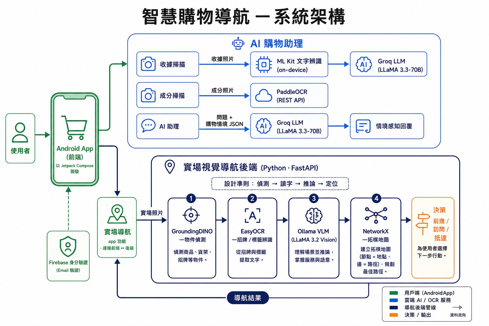

<div align="center">

# 🛒 智慧購物導航 · Smart Shopping Navigation

*手機拍照即定位的賣場導航 App，整合相機 OCR、雲端大型語言模型與本地視覺導航後端*


</div>

「智慧購物導航」是一款 Android（Kotlin / Jetpack Compose）購物助理 App，採**單一 Activity** 架構，並搭配一個**獨立的 Python / FastAPI 後端**負責賣場內視覺定位。它把「找商品、控預算、顧健康」整合在同一個 App，且賣場導航**不需在現場裝設藍牙 / Wi-Fi 信標**。

> **指導教授**:吳世琳、陳嶽鵬 　|　**成員**:B1229013 陳宜伶 · B1229020 何思顗 · B1229023 林依賢 · B1222017 周庠

---

### 目錄
[功能總覽](#功能總覽) ·
[系統架構](#系統架構) ·
[資料流與模型管線](#資料流與模型管線) ·
[資料模型與持久化](#資料模型與持久化) ·
[後端-api-參考](#後端-api-參考) ·
[技術堆疊](#技術堆疊) ·
[金鑰設定](#金鑰設定-env) ·
[建置與執行](#建置與執行) ·
[專案結構](#專案結構) ·
[開發狀態](#開發狀態) ·
[限制與容錯](#限制與容錯)

---

## 功能總覽

App 以底部六分頁(`MainContainer`)為主體，外加導航、登入與設定。下表對應「畫面 → 功能 → 實際使用的服務/模型 → 主要程式檔」:

| 分頁 / 畫面 | 功能 | 服務 / 模型 | 主要檔案 |
|---|---|---|---|
| 首頁 | 商品搜尋、快速加入清單(縮圖 Coil) | — | `HomeScreen.kt` |
| 清單 | 購物項目 CRUD / 勾選 | 本地 JSON | `ShoppingListScreen.kt` |
| 分析 | 成分拍照辨識、過敏原警示、熱量↔運動換算 | **PaddleOCR (REST)** + 內建字典/MET 表 | `IngredientsScreen.kt` |
| 預算 | 收據拍照 → 結構化 → 入帳 + 圓環圖 | **ML Kit OCR** + **Groq**(JSON) | `MainContainer.kt`(`BudgetScreen`) |
| 紀錄 | 消費 / 購物歷史 | 本地 JSON | `HistoryScreen.kt` |
| 助理 | 情境感知購物諮詢(多輪) | **Groq** `llama-3.3-70b-versatile` | `AIScreen.kt` |
| 賣場導航 | 相機即時 + AR 店家標記 + 逐步指引 | CameraX + GPS / Places(視覺模型待接後端) | `NavigationScreen.kt` |
| 附近門市 | 周邊門市清單 / AR 標記 | **Google Places** + FusedLocation | `NearbyStoresSheet.kt` · `NearbyStoresAr.kt` |
| 登入 / 設定 | 註冊登入 + Email 驗證 / 個資 + 快取 | **Firebase Auth** | `LoginScreen.kt` · `SettingsScreen.kt` |

---

## 系統架構

App 端直接呼叫雲端服務完成「OCR + 文字理解」;賣場視覺定位則交由獨立後端的「偵測 → 讀字 → 推論 → 拓樸」管線處理。

<div align="center">



</div>

```
        Android App  (com.example.shopping · 單一 Activity + Compose)
        MainActivity → NavHost(起始頁 login)
        login · main_list(六分頁) · teammate_home · ar_navigation · settings
                          │
        ┌─────────────────┼──────────────────────────────┐
        ▼                 ▼                               ▼
  Firebase Auth     雲端 AI / OCR 服務                賣場視覺定位
  (帳號/驗證)   Groq · ML Kit · PaddleOCR · Places    （上傳照片）
                                                          │
                                                          ▼
            Python 後端 backend/(FastAPI · 獨立資料夾)
            GroundingDINO → EasyOCR → Ollama VLM → NetworkX 拓樸地圖
```

後端的完整模組、安裝與啟動見 **[`backend/README.md`](backend/README.md)**。

---

## 資料流與模型管線

系統的「智慧」來自兩條獨立管線。

**① App 端 — OCR → LLM 結構化**

```
收據:  拍照 → ML Kit TextRecognition → Groq(response_format=json) → TidiedReceiptResponse → 入帳 + DonutChart
成分:  拍照 → PaddleOCR(REST) → 內建過敏原字典比對 + MET 熱量換算 → DietRecord
助理:  使用者問題 + ShoppingContext(庫存+預算+健康 JSON 快照) → Groq → 跨模組回答(多輪)
```

**② 後端 — 賣場視覺導航(設計準則:先偵測 → 再讀字 → 後推論 → 拓樸定位)**

```
顧客照片
   └─▶ GroundingDINO 物件偵測(貨架商品/冰箱/走道/標示)
          └─▶ EasyOCR 招牌與貨架文字辨識
                 └─▶ Ollama VLM(LLaMA 3.2 Vision)整合影像+偵測+OCR+地圖摘要
                        └─▶ NetworkX 拓樸地圖(節點=位置 · 邊=走過路徑)
                               └─▶ 導航動作:MOVE / ASK / ARRIVED ──(指引)──▶ 回到 App
```

---

## 資料模型與持久化

狀態集中於 `MainContainer`(`shoppingItems` / `dietRecords` / `budgetTotalStr`),以 **kotlinx.serialization** 寫入 `filesDir`。

| 本地檔 | 內容 | 對應資料類別 |
|---|---|---|
| `shopping_list.json` | 購物清單 | `ShoppingItem` |
| `diet_records.json` | 飲食 / 營養紀錄 | `DietRecord` |
| `monthly_budget.txt` | 月預算總額 | — |
| `user_profile.json` | 個人資料 / 過敏原 | `UserProfile` |

**主要欄位**
- `ShoppingItem` — `name` / `qty` / `price` / `isChecked` / `createdAt` / `purchasedAt` / `dueDate` / `storeName` / `location` / `receiptId`
- `DietRecord` — `name` / `ingredients` / `expiryDate` / `unitCalorie` / `portion` / `totalCalories` / `carbs` · `sugar` · `protein` · `fat` · `cholesterol` · `sodium` / `foodCategory`
- `UserProfile` — `gender` / `birthday` / `height` / `weight` / `allergies` / `disease` / `activityLevel`
- `ShoppingContext`(`model/ShoppingContext.kt`)— 由 `buildShoppingContext()` 把庫存 / 預算 / 健康彙整成 JSON 快照,於每次提問注入 AI 助理的系統提示。

---

## 後端 API 參考

後端為一般 REST 服務(`server/server.py`),客戶端依下列端點互動:

| 方法 | 路徑 | 說明 | 回傳重點 |
|---|---|---|---|
| `POST` | `/session` | 建立導航 session(輸入商品目標) | `session_id` · `goal_objects` |
| `POST` | `/session/{id}/photo` | 上傳一張照片取得導航動作 | `action`(MOVE/ASK/ARRIVED) · `guidance` · `annotated_photo_url` |
| `POST` | `/session/{id}/answer` | 回答 ASK 問題後繼續 | 同上 |
| `GET` | `/session/{id}/map?format=json\|png` | 取得目前拓樸地圖 | JSON 或 PNG |
| `GET` | `/session/{id}` | 取得 session 狀態 / 歷史 | session 物件 |
| `GET` | `/session/{id}/photo/{node}.jpg` | 取得標註後影像 | 影像 |
| `GET` | `/health` | 健康檢查 | `{"status":"ok"}` |

> 用法範例與啟動方式見 [`backend/README.md`](backend/README.md)。

---

## 技術堆疊

> 以 `app/build.gradle.kts` 與 `gradle/libs.versions.toml` 為準。

**Android** — Kotlin 2.2.10 · Jetpack Compose(Material 3 / navigation-compose / icons-extended)· Coil 2.7.0 · kotlinx.serialization · Retrofit 2.9.0 + Gson + OkHttp · CameraX 1.5.3 · Firebase Auth (BoM 33.9.0) · ML Kit Text Recognition 16.0.1 · play-services-location 21.3.0 · Places SDK (New) 4.1.0
**雲端 LLM** — Groq `llama-3.3-70b-versatile`(AI 助理 + 收據結構化)
**OCR** — ML Kit(收據)· PaddleOCR 自架 REST(成分)
**後端** — Python 3.12 · FastAPI · GroundingDINO · EasyOCR · Ollama(LLaMA 3.2 Vision)· NetworkX
**備註** — Gemini generativeai 0.9.0 仍列為相依,但程式碼目前一律改用 Groq。

---

## 金鑰設定 (.env)

金鑰放在專案根目錄 `.env`(已 `.gitignore`,參考 `.env.example`),建置時注入 `BuildConfig`:

```bash
MAPS_API_KEY=            # Google Places / Maps（亦注入 AndroidManifest）
GROQ_API_KEY=            # Groq LLM
PADDLEOCR_ACCESS_TOKEN=  # PaddleOCR REST
GEMINI_API_KEY=          # 目前未實際使用
```

---

## 建置與執行

**Android App**
```bash
git clone https://github.com/B1229013/Shopping-Navigation.git
cd Shopping-Navigation
# 1) 複製 .env.example 為 .env 並填入金鑰
# 2) 放入 Firebase 設定檔 app/google-services.json
gradlew.bat :app:assembleDebug    # Windows（macOS/Linux 用 ./gradlew）
gradlew.bat :app:installDebug     # 或在 Android Studio 直接 ▶ Run
```
需求:Android Studio + JDK 11、Android SDK(compileSdk 35)、裝置 Android 7.0 (API 24)+。手機端不需自行下載大型模型(Groq 雲端、ML Kit 隨 Play Services、PaddleOCR 走 REST)。

**後端導航伺服器** — 為**獨立資料夾**,其安裝、模型下載(Ollama `llama3.2-vision`、GroundingDINO 權重)與啟動請見 👉 **[`backend/README.md`](backend/README.md)**。

---

## 專案結構

```
Shopping-Navigation/
├── app/  ── src/main/java/com/example/shopping/
│   ├── MainActivity.kt              # 單一 Activity + NavHost
│   ├── model/                       # ShoppingItem · DietRecord · UserProfile · ShoppingContext
│   └── ui/
│       ├── screens/                 # MainContainer(含 BudgetScreen)· Home · ShoppingList
│       │                            #   Ingredients · History · AI · Navigation · NearbyStores …
│       ├── components/ · utils/ · theme/
├── backend/                         # Python 後端導航伺服器(FastAPI)— 見 backend/README.md
│   ├── server/                      # GroundingDINO · EasyOCR · Ollama VLM · NetworkX
│   ├── eval/ · generate_topomap.py · build_store_*.py …
│   └── README.md
└── Map/ · .env.example · build.gradle.kts · settings.gradle.kts
```

---

## 開發狀態

| 模組 | 狀態 |
|---|---|
| 購物清單 / 預算 / 收據 / 飲食 / AI 助理 / 附近門市 / 登入設定 | ✅ 已實作 |
| 賣場導航 UI(CameraX 即時、每 3 秒取樣、AR 店家標記、模擬圖片) | ✅ 已實作 |
| 賣場視覺定位推論(`NavigationScreen.processImageForModel()`) | 🚧 佔位中,待串接 `backend/` |
| 後端導航伺服器(偵測→OCR→VLM→拓樸) | ✅ 可獨立運作(`backend/`) |
| App ⇄ 後端串接 | 🚧 進行中 |

---

## 限制與容錯

- **賣場視覺定位尚未完整串接**:`NavigationScreen` 逐幀分析目前僅記錄並關閉影像。
- **OCR 受光學條件影響**:光線不足、反光、字體過小會降低 ML Kit / PaddleOCR 成功率。
- **第三方 API 配額**:Groq、Places 受官方頻率 / 配額限制,需網路連線。
- **容錯與安全**:LLM 呼叫以 `try-catch` 包覆並於對話回報錯誤;金鑰經 `.env`→`BuildConfig`(不入庫);資料僅存 `filesDir`;Email 未驗證帳號自動 `signOut()` 攔截。
